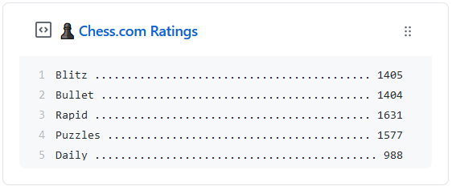

<p align='center'>
  
  <h3 align="center">chess-com-box-py</h3>
  <p align="center">♟︎ Update a pinned gist to contain your Chess.com Blitz, Bullet, Rapid, Puzzles & Daily Ratings</p>
  <p align="center">
    
  </p>
</p>

---

> 📌✨ For more pinned-gist projects like this one, check out: https://github.com/matchai/awesome-pinned-gists

## 🎒 Prep Work

1. Create a new public GitHub Gist (https://gist.github.com/)
2. Create a token with the `gist` scope and copy it. (https://github.com/settings/tokens/new)
3. Copy the `API token`

## 🖥 Project Setup

1. Fork this repo
2. Go to your fork's `Settings` > `Secrets` > `Add a new secret` for each environment secret (below)

## 🤫 Environment Secrets

- **GH_TOKEN:** The GitHub token generated above.
- **GIST_ID:** The ID portion from your gist url:

  `https://gist.github.com/sciencepal/`**`ce5221fc5f3739d2c81ce7db99f17519`**.

  (Alternatively this can be put directly in `.github/workflows/chesscom.yml` as it is public anyway.)
- **CHESS_COM_USERNAME:** Your [chess.com](https://chess.com) username. (This can also be put directly in the yml)

## 🤓 Hacking

```bash
# setup
pipenv install --dev
# testing
pipenv run python chess_com_box.py test <gist-id> <github-token> <user>
# example
# pipenv run python chess_com_box.py test ce5221fc5f3739d2c81ce7db99f17519 cf9181618bf1618253d17161843f71a2bb161850 sciencepal
```

## ✨ Credits
This code was heavily inspired (with some code taken over) by [@aksh1618's codestats-box-python](https://github.com/aksh1618/codestats-box-python).
